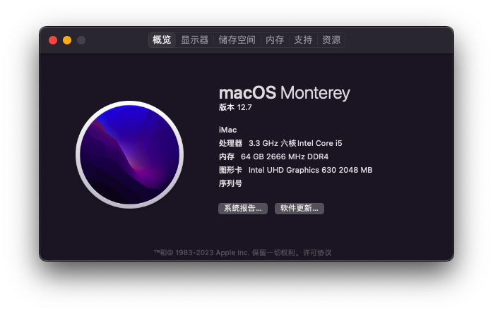

# EFI-B460-i5-10600

## 鸣谢

感谢 bilibili 用户@杆杆只爱学习的参考文章：(https://www.bilibili.com/read/cv9723616)

## 说明

虽然标题上写了 B460，实际上这个 EFI 通用了 10 代主板及 10 代 U，可自行食用

哦对了，奔腾和赛扬是不行的

## 个人配置

~~换配置好耶~~
| | |
| -------- | ---------------------------------------------------------------- |
| CPU | i3-10100 → i5-10600 |
| 主板 | 华硕 TUF GAMING B460M-PLUS → 昂达 H410SD4 ITX |
| 内存 | 三星 DDR4 3200 64GB （16G × 4）→ 三星 DDR4 2666 32GB （16G × 2） |
| 主硬盘 | 光威 Basic 256GB M2.NVME → 光威 Basic 1TB M2.NVME |
| 机械硬盘 | 东芝 HDWG480 8TB ×2 |
| 显卡 | 英特尔 Graphic UHD 630 |
| 声卡 | 瑞昱 @ 英特尔 High Definition Audio 控制器 |
| 网卡 | 英特尔 Ethernet Connection I219-V / 华硕 |
| 无线网卡 | 英特尔 AX201 |

## 驱动说明

- [x] 声卡驱动
- [x] 无线网卡工作
- [x] 多显示器支持功能
- [x] 核芯显卡 2GB 显存(默认 1.5GB，可选 4GB)
- [x] 睡眠唤醒
- [ ] HDMI 接口唤醒重启显示器

---

显卡使用 983E0000，已使用 DP 转 HDMI 通道

## 部分问题

- 核芯显卡出现显存只有 7MB 及HDMI黑屏

解决方法：https://www.bilibili.com/read/cv17065801/

HDMI黑屏：https://www.bilibili.com/read/cv26056472/

以防万一留下备份

- 主显示器在睡眠唤醒后需要重启显示器

解决方法：https://macoshome.com/hackintosh/hcourse/5449.html

~~我懒，所以就不改了~~ 其实是工作原因大部分时候主显示器都是常亮的

- 使用 iStat 等软件读取不到 CPU 风扇转速

解决方法：https://www.163.com/dy/article/EB2QAP8Q05327760.html

~~同样是懒~~ 对我个人来说我只注意 CPU 温度

- 我想要 4G 核显显存

方案：https://www.bilibili.com/read/cv10707843/

~~虽然 4G 和 2G 显存提升几乎微乎其微~~

- 是否可升级到`Ventura`和 `Sonoma`

~~等我过几天逝逝看~~